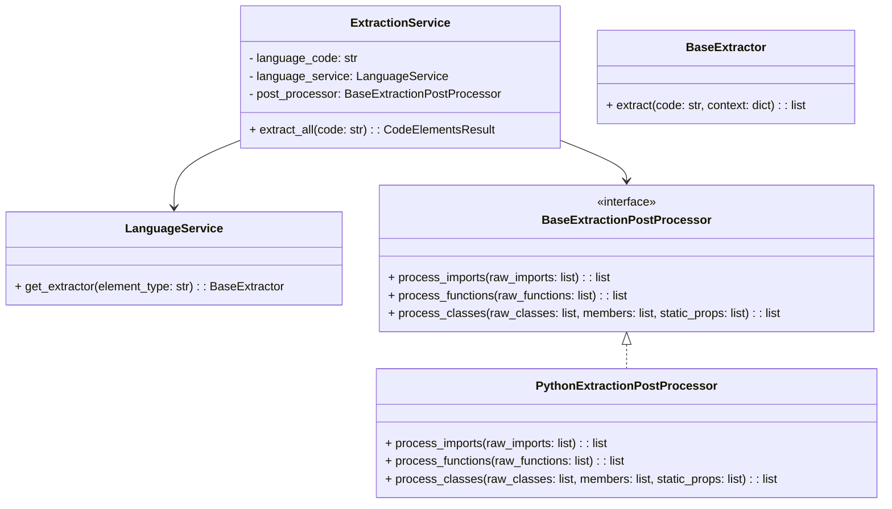

# Refactoring Plan for ExtractionService

## Goals
- Decouple language-specific post-processing from core orchestration.
- Split the monolithic `ExtractionService` into smaller, focused components.
- Make it easier to extend for other languages without modifying a huge file.
- Preserve the facade pattern for easy use.

---

## Current State

- `ExtractionService` is a large class (~1000+ lines).
- It mixes:
  - Initialization and orchestration.
  - Delegation to language-specific extractors.
  - Language-specific post-processing (decorators, static properties, etc.).
- Language-specific extractors are already modular, but post-processing is centralized and complex.

---

## Proposed Architecture

### 1. Extraction Facade
A slim `ExtractionService` that:
- Initializes with a language code.
- Delegates extraction to language-specific extractors.
- Coordinates the extraction process.
- Contains **no language-specific post-processing**.

### 2. Language-specific Post-Processors
- Separate **post-processing classes** per language, e.g., `PythonExtractionPostProcessor`.
- Responsible for:
  - Transforming raw extraction dicts into structured elements.
  - Handling decorators, static properties, etc.
- Registered or injected into the facade.

### 3. Extractor Registry
- Already exists, but can be **extended to include post-processors**.
- Allows easy registration of new languages.

---

## Refactoring Steps

### Step 1: Define clear module boundaries
- Extraction Facade
- Language-specific Post-Processors
- Extractor Registry

### Step 2: Modularize the code
- **Move post-processing methods** out of `ExtractionService`:
  - `_process_import_element`
  - `_process_function_element`
  - `_process_class_element`
  - `_process_method_element`
  - `_process_static_property`
  - `_process_decorators`
  - `_process_parameters`
  - `_process_return_value`
- **Create a base interface** for post-processors:

```python
class BaseExtractionPostProcessor(ABC):
    @abstractmethod
    def process_imports(self, raw_imports: List[Dict]) -> List[CodeElement]: ...
    @abstractmethod
    def process_functions(self, raw_functions: List[Dict]) -> List[CodeElement]: ...
    @abstractmethod
    def process_classes(self, raw_classes: List[Dict], members: List[Dict], static_props: List[Dict]) -> List[CodeElement]: ...
```

- **Implement language-specific subclasses**:
  - `PythonExtractionPostProcessor(BaseExtractionPostProcessor)`
  - Future: `JavaExtractionPostProcessor`, etc.

- **Inject the post-processor** into `ExtractionService` during initialization or via registry lookup.

### Step 3: Update the extraction flow
- `ExtractionService.extract_all()` will:
  1. Call `_extract_file_raw()` to get raw dicts.
  2. **Delegate post-processing** to the language-specific post-processor.
  3. Collect and return the final `CodeElementsResult`.

### Step 4: Optional improvements
- Split extractors into smaller, element-type-specific classes (already partially done).
- Introduce plugin architecture for new languages.
- Add more tests for each component separately.

---

## Mermaid Diagram



---

## Summary

- The **core extraction orchestration** is already language-agnostic.
- The **main problem is the huge, monolithic post-processing logic**.
- **Refactor by extracting language-specific post-processing** into dedicated classes.
- **Keep the facade pattern** for ease of use.
- This will **reduce file size, improve modularity, and ease future language support**.